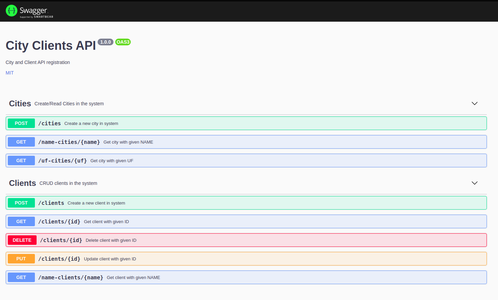

# CityClient-api

## Run

```bash
sudo docker-compose up --build
```

## Get Documentation

http://localhost:3333/api-docs/



## Postman Collection

https://www.getpostman.com/collections/c4cb3ea834bc2b0f2a0d

## Run Tests

```bash
yarn test
```
